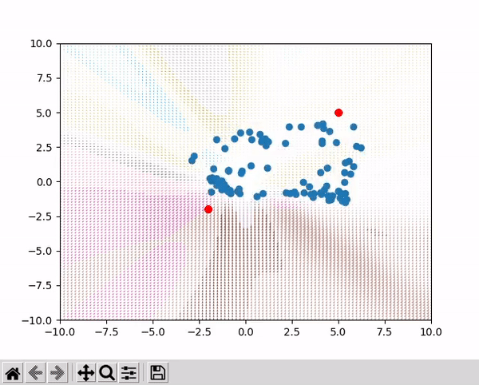

# Learning-Iterative-Reasoning-through-Energy-Minimization
My implementation of arXiv:2206.15448 

 
Blue dots are randomly generated y's, red dot is the y target and the arrows visualize the vector field that has been learned (implicitly). 
 

 
Notice also that the output is unimodal not multimodal!!! 
 

